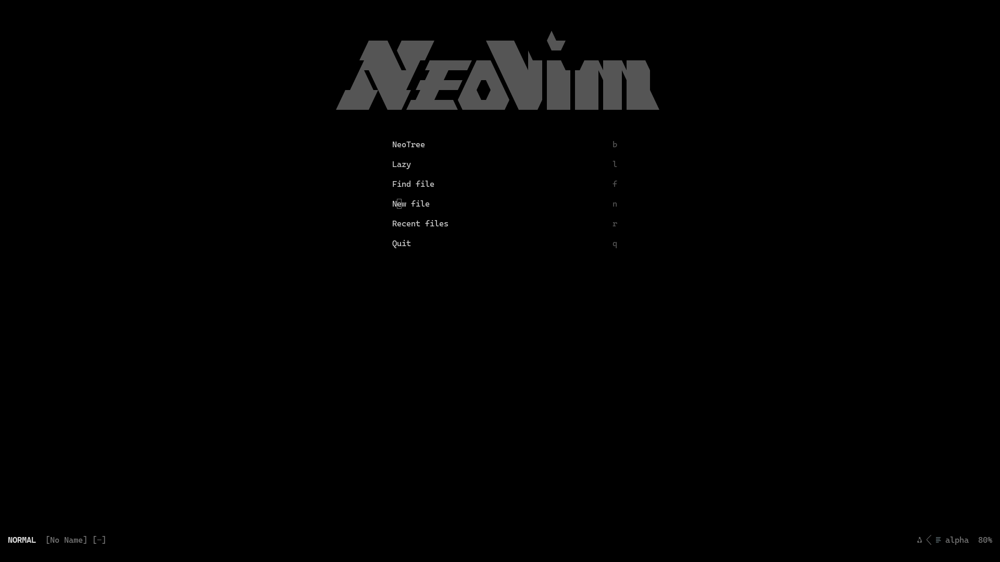

# About
This is my neovim config, is comfy for me.

# Main Plugins

| function | plugin |
| -------- | ------ |
| filetree | [neo-tree](https://github.com/nvim-neo-tree/neo-tree.nvim) |
| autocompletion | [cmp](https://github.com/hrsh7th/nvim-cmp) |
| lsp | [mason](https://github.com/mason-org/mason.nvim) |
| fuzzyfinder | [telescope](https://github.com/nvim-telescope/telescope.nvim) |
| terminal | [toggleterm](https://github.com/akinsho/toggleterm.nvim) |

# Secondary plugins
- [alpha](https://github.com/goolord/alpha-nvim)
- [autopairs](https://github.com/windwp/nvim-autopairs)
- [comment](https://github.com/numToStr/Comment.nvim)
- [luanine](https://github.com/nvim-lualine/lualine.nvim/)
- [luasnip](https://github.com/L3MON4D3/LuaSnip)
- [neoscroll](https://github.com/karb94/neoscroll.nvim)
- [noice](https://github.com/folke/noice.nvim)
- [smear](https://github.com/sphamba/smear-cursor.nvim)
- [surround](https://github.com/kylechui/nvim-surround)
- [themify](https://github.com/LmanTW/themify.nvim)
- [transparent](https://github.com/xiyaowong/transparent.nvim)
- [treesitter](https://github.com/nvim-treesitter/nvim-treesitter)
